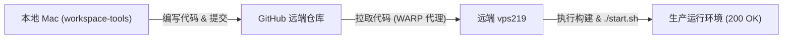

# Bio-literature 文献套件项目规范与 Harness 准则

> **⚠️ 核心提醒**：后期无论对 `bio-literature-digest`（抓取端）还是 `bio-literature-digest-web`（Web 端）进行任何功能扩展、性能优化或运维修复，**都必须先通读本规范并严格遵守**。

---

## 一、 项目定位与双核架构

本项目是由两个紧密关联但职责解耦的独立工程构成的生物学文献智能化处理与阅读套件：

```text
/Users/mumu/workspace/workspace-tools/Bio-literature/
├── bio-literature-digest/         # 【抓取端 / Producer】RSS 订阅、智能过滤、翻译、邮件发送与本地归档
│   ├── Git 仓库: git@github.com:mumu-140/BioPlant-literature-skills.git
│   └── 生产机路径: vps219:/root/software/bio-literature-digest
│
└── bio-literature-digest-web/     # 【Web 消费端 / Consumer】文献门户、全文检索、学术阅读器与推送工作台
    ├── Git 仓库: https://github.com/mumu-140/bio-literature-digest-web.git
    └── 生产机路径: vps219:/root/software/bio-literature-digest-web
```

### 1. 各子项目核心职责

| 模块 | 项目名 | 核心职责 | 技术栈 |
| :--- | :--- | :--- | :--- |
| **生产端 (Producer)** | `bio-literature-digest` | 监控 CNS / eLife 等主流期刊 RSS，关键词与 Prompt 过滤分类，文献翻译，生成日度 Markdown / HTML / CSV，发送邮件日报，维护归档库与原始 SQLite。 | Python 3, PyYAML, Requests, SQLite |
| **消费端 (Consumer/Web)** | `bio-literature-digest-web` | 独立 Web 门户工作台，提供 FTS5 全文搜索、多维文献分类过滤、旗舰期刊高亮、一键复制 DOI、多选批量推送、收藏与评审、Zotero/EndNote 导入、DeerFlow SSO 讨论接入。 | 前端：Vite + React 19 + TS<br>后端：FastAPI + SQLite WAL<br>穿透：Cloudflare Tunnel |

### 2. 双工程协作边界与数据隔离铁律

1. **同级拓扑与相对发现**：
   - Web 端通过 `bio-literature-config/paths.env` 中的 `PRODUCER_ROOT=@project/../bio-literature-digest` 自动关联同级生产端。
2. **【单向只读铁律】**：
   - Web 端的同步后台（`sync_archives.py`）**只对生产端的归档与数据库作只读读取**，并将增量数据写入 Web 独立的数据库（`bio-literature-config/data/web/bio_digest_web.db`）。
   - **绝对禁止 Web 端服务或脚本修改、覆盖或删除生产端 `var/`、配置或原始数据库**！

---

## 二、 全局不可逾越之红线原则

### 0. 【全局第一红线】绝对禁止在本地构建与部署
* **所有生产服务、前端或后端的构建、依赖安装与编译（Vite、tsc、Node、npm、pip、Docker 等）一律在远端目标机 (`vps219`) 或容器内执行**。
* 本地 Mac 只做代码阅读、业务编排、轻量单元测试与 Git 指针同步，**绝不在本地跑构建，绝不产生本地构建产物入库**。

### 1. 操作前必备份，改动前定方案
* 涉及数据库迁移、字段调整前，必须备份 Web SQLite 快照至 `bio-literature-config/data/web/backups/`。
* 涉及核心代码重构或性能改动前，必须在远端仓库打 Git Tag 或保留分支备份。

### 2. 凭据与安全隔离
* 任何环境配置（`.env`、`*.local.yaml`）、鉴权密码、会话秘钥、Cloudflare 隧道凭据（`tunnel.json`）**严禁提交入库**。
* 代码库只保留模板文件（如 `.env.example`、`config.yml.example`）。

### 3. 单入口反代与网络规范
* 生产机 `vps219` 的公网暴露一律由 Cloudflare Tunnel 回源至统一入口或由本机 Caddy 分流。
* Cloudflare Tunnel 回源严格按 Host 分流，严禁将外部流量直达非必要后端端口。

---

## 三、 Harness 研发与工程化规范

项目遵循标准化 Harness 架构，确保“路径自解析、代码有门禁、自愈可度量、性能有保证”：

### 1. 动态实例路径解析（Instance Paths）
- 严禁在脚本或代码中硬编码任何绝对物理路径。
- 所有运行时目录、数据目录、日志目录一律使用 `tools/resolve_instance_path.py` 与 `bio-literature-config/paths.env` 动态解析：
  ```bash
  # 解析当前环境下的数据目录
  python3 tools/resolve_instance_path.py WEB_DATA_DIR
  ```

### 2. 质量门禁（Quality Gates）
在将代码推送或上线前，必须在对应的环境下执行质量门禁：

#### Web 端门禁（在远端 `vps219` 执行）：
```bash
# 1. 自动化测试套件（覆盖 DeerFlow 隔离校验、LRU 缓存淘汰与状态同步）
npm test

# 2. TypeScript 严格类型检查（要求 0 错误、0 警告）
npx tsc --noEmit

# 3. 生产打包验证
npm run build
```

#### 生产端门禁（执行测试）：
```bash
python3 -m unittest discover -s tests
```

### 3. 服务自愈流水线（Launch Signature Harness）
- 生产环境采用 `tools/compute_launch_signature.py` 自动化检测代码与配置签名。
- 执行 `./start.sh` 时，启动器会自动比对当前版本与运行中实例的签名；**仅当检测到代码或配置真正变更时，才会平滑平退并拉起新进程**，避免无关重启打断当前访问。

### 4. 性能与全链路缓存规范
为保障跨洋访问体验（消除物理高延迟），系统确立了两层缓存标准，后续开发不得打破：
1. **前端内存缓存层 (SWR / LRU Cache)**：
   - 核心代码位于 `frontend/src/features/digest/cache/`。
   - 所有日期组与概览查询必须经过 `digestCacheService`，保证已浏览日期的**0ms 瞬间秒开**与请求并发去重。
   - 使用 `useDigestPrefetch` 在浏览器空闲时自动预拉取时间线相邻日期。
   - 收藏状态变化必须通过 `updatePaperFavoriteState` 保证跨日期多维缓存原子同步。
2. **网络与 HTTP 响应头规范**：
   - 静态资源：Vite 产物必须注入 `Cache-Control: public, max-age=31536000, immutable`，确保 Cloudflare 边缘 CDN 永久命中。
   - 业务接口：返回 `Cache-Control: private, max-age=120~300`，允许客户端浏览器本地缓存，同时保障多用户收藏状态不串号。

---

## 四、 本地、远端与 GitHub 三端同步流程

开发任何功能时，必须严格执行三端同步闭环：



1. **本地编写**：在 `/Users/mumu/workspace/workspace-tools/Bio-literature/` 对应子项目中编写代码。
2. **Git 提交并推送**：
   ```bash
   git commit -m "feat/fix: ..."
   git push origin <branch>
   ```
3. **远端部署**（在 `vps219` 上执行）：
   ```bash
   ssh vps219
   cd /root/software/bio-literature-digest-web  # 或 producer
   export PATH=/root/software/node-v24.18.0-linux-x64/bin:$PATH
   git fetch origin && git pull
   ./start.sh
   ```
4. **线上验证**：
   - 检查公网 `https://accept.yangsen666.cloud`
   - 检查后端 `http://127.0.0.1:8602/healthz`
5. **台账同步**：
   - 同步更新 `/Users/mumu/workspace/VPS/servers/vps219.md` 和 `site/inventory.json`，确保基础设施台账记录最新版本号。
